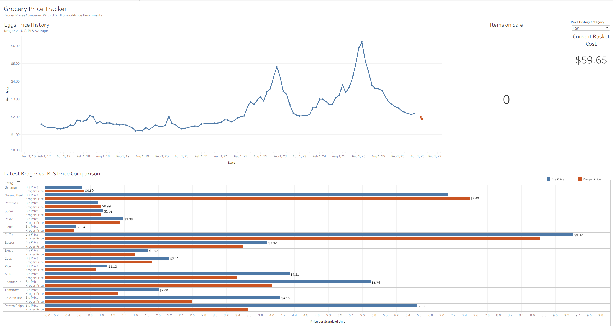
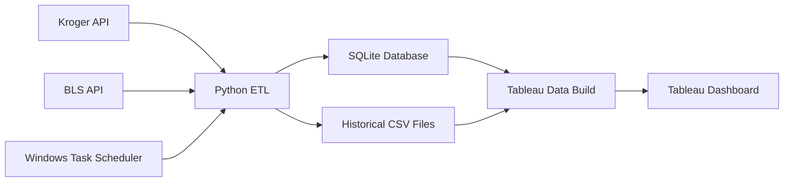

# Grocery Price Tracker

An end-to-end data analytics project that automatically tracks Kroger grocery prices and compares them with historical U.S. Bureau of Labor Statistics food-price benchmarks.

The project combines API data collection, Python ETL, SQLite, automated scheduling, and Tableau to analyze grocery price trends, promotions, and current basket costs.

## Dashboard Preview



## Project Overview

The Grocery Price Tracker collects daily prices for a basket of 22 grocery products from the Kroger API and compares 16 matching food categories against historical Bureau of Labor Statistics average-price data.

The project was built to answer questions such as:

- How do current Kroger prices compare with national food-price benchmarks?
- How have grocery prices changed over time?
- Which tracked products are currently on sale?
- What does the current 22-item grocery basket cost?
- How can products with different package sizes be compared consistently?

## Tech Stack

- **Python** for data collection, transformation, and pipeline development
- **Pandas** for cleaning and preparing analytical datasets
- **REST APIs** for Kroger and BLS data acquisition
- **SQLite / SQL** for structured historical price storage
- **Windows Task Scheduler** for automated daily collection
- **Tableau** for interactive dashboards and visualization
- **Git / GitHub** for version control and project documentation

## Data Pipeline



### Daily Workflow

1. Authenticate with the Kroger API
2. Retrieve prices for 22 selected grocery products
3. Capture regular and promotional prices
4. Normalize package prices into comparable standard units
5. Append new observations to historical storage
6. Update the SQLite database
7. Rebuild Tableau-ready datasets
8. Refresh the dashboard with the latest observations

## Dashboard Features

### Historical Price Trends

The dashboard combines historical BLS food-price data with current Kroger observations.

A category selector allows users to explore products such as eggs, milk, bread, ground beef, rice, and other common grocery categories.

### Latest Kroger vs. BLS Price Comparison

Current Kroger prices are compared with the latest available BLS benchmark using standardized units such as:

- price per pound
- price per gallon
- price per dozen

This helps make products with different package sizes more comparable.

### Current Basket Cost

The dashboard calculates the cost of purchasing one package of each of the 22 tracked Kroger products using the latest available price.

### Items on Sale

The dashboard automatically counts the number of tracked products currently on promotion.

When promotional prices are available, the underlying pipeline also calculates:

- regular price
- promotional price
- dollar savings
- percentage savings

## Data Sources

### Kroger API

Used to collect current product-level information including:

- product name
- product ID
- package size
- regular price
- promotional price
- store location

### U.S. Bureau of Labor Statistics

BLS Average Price Data provides the historical benchmark for 16 comparable grocery categories.

The historical dataset includes observations beginning in 2017.

## Price Standardization

Package prices cannot always be compared directly.

For example:

- an 8 oz cheese package is converted to price per pound
- a half-gallon beverage is converted to price per gallon
- eggs are standardized to price per dozen

The pipeline calculates:

```text
Normalized Price = Effective Package Price / Standardized Quantity
```

The effective price uses the promotional price when a valid promotion exists and otherwise uses the regular price.

## Project Structure

```text
grocery-price-tracker/
│
├── assets/
│   └── dashboard.png
│
├── data/
│   ├── products.csv
│   ├── price_history.csv
│   └── bls_price_history.csv
│
├── scripts/
│   ├── kroger_auth.py
│   ├── get_locations.py
│   ├── get_products.py
│   ├── collect_prices.py
│   ├── init_database.py
│   ├── check_database.py
│   ├── get_bls_history.py
│   ├── check_bls.py
│   ├── build_tableau_data.py
│   └── run_daily_collection.bat
│
├── tableau/
│   ├── price_history_long.csv
│   ├── latest_price_comparison.csv
│   └── grocery_price_tracker.twbx
│
├── .gitignore
└── README.md
```

## Automation

The Kroger collection pipeline runs through Windows Task Scheduler.

```text
Scheduled Task
      ↓
Kroger API Collection
      ↓
Historical CSV + SQLite
      ↓
Tableau Data Build
      ↓
Updated Dashboard Data
```

Raw daily API snapshots and execution logs are stored locally but excluded from GitHub.

## Security

API credentials are stored in a local `.env` file and loaded through environment variables.

The following are excluded from version control:

- `.env`
- SQLite database files
- raw API snapshots
- execution logs
- Tableau temporary files

No Kroger API credentials are stored in this repository.

## Skills Demonstrated

- Python scripting
- Pandas data transformation
- REST API integration
- SQL and SQLite
- ETL pipeline development
- Data normalization
- Historical data collection
- Workflow automation
- Data quality validation
- Tableau dashboard development
- Data visualization
- Git and GitHub version control

## Future Improvements

Potential extensions include:

- comparing multiple grocery retailers
- tracking prices across geographic locations
- expanding the product basket
- calculating a custom grocery inflation index
- adding weekly and monthly price-change metrics
- migrating the automated pipeline to a cloud environment
- publishing a periodically refreshed Tableau Public version
